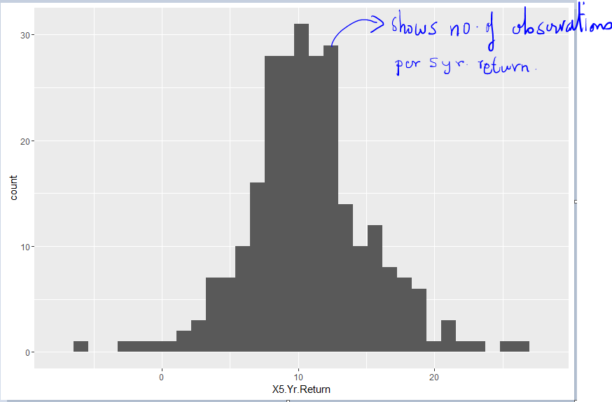

The goal
--------

In this first chapter lets learn how to display and interpret data using
some common display tools using R. Lets use the Mutual Funds.xls data
which contains data on 259 mutual funds with some qualitative
information on the fund type, objectives and risk buckets but also gives
some quantitative performance metrics like 3 Year and 5 Year returns and
best and worst quarter returns.

Lets start our journey into understanding data with the simplest plot
for quantitative information which is the stem and leaf plot.

Presenting data
---------------

### Stem and Leaf plot

The stem and leaf plot is a simple plot which separates the data entries
into leading digits or stems and trailing digits or leaves. The plot
basically shows how the values distribute and cluster over the range of
the observations in the data set.

In R there is a function called stem which is very suitable to display
this data. It takes in 4 arguments out of which the first 2 are the most
important. The first argument is an ordered vector of a variable and the
second argument controls the height of the plot.

    library(xlsx)

    ## Warning: package 'xlsx' was built under R version 3.2.3

    ## Loading required package: rJava

    ## Warning: package 'rJava' was built under R version 3.2.3

    ## Loading required package: xlsxjars

    ## Warning: package 'xlsxjars' was built under R version 3.2.3

    mf_return <- read.xlsx(file = "./data/Mutual Funds.xls", sheetName = "Data")
    head(mf_return)

    ##                                  Fund       Type Objective Assets Fees
    ## 1 ABN Amro Montag & Calswell Growth I large cap     Growth 1184.9   No
    ## 2             AIM Aggressive Growth A small cap     Growth 2639.2  Yes
    ## 3                   Aim Basic Value A large cap      Value 1863.9  Yes
    ## 4              Aim Small Cap Growth A small cap     Growth  602.2  Yes
    ## 5                        AIM Summit I large cap     Growth 1912.5  Yes
    ## 6                         AIM Value B large cap     Growth 9232.2   No
    ##   Expense.ratio Return.2001 X3.Yr.Return X5.Yr.Return Turnover    Risk
    ## 1          0.77       -13.1         -0.2         11.7      low average
    ## 2          1.04       -26.0          3.4          5.4      low    high
    ## 3          1.32         0.1         16.7         16.7  average     low
    ## 4          1.13       -13.8         17.7         18.5      low    high
    ## 5          0.72       -33.8         -5.2          7.3  average    high
    ## 6          1.77       -13.6         -2.1          8.8  average average
    ##   Best.Quarter Worst.Quarter
    ## 1         27.1         -15.5
    ## 2         31.4         -24.7
    ## 3         21.1         -17.3
    ## 4         38.1         -24.4
    ## 5         37.1         -30.3
    ## 6         27.1         -16.0

    # Order the 5 Year returns of the 259 Mutual funds
    mf_order_5yr_return <- mf_return$X5.Yr.Return[order(mf_return$X5.Yr.Return)]

    mf_order_5yr_return

    ##   [1] -6.1 -2.8 -1.2 -0.7  0.5  1.8  1.9  2.5  2.8  2.8  3.3  3.5  3.8  3.8
    ##  [15]  4.0  4.2  4.3  4.4  4.5  4.6  4.8  5.0  5.1  5.2  5.4  5.4  5.5  5.5
    ##  [29]  5.8  5.9  6.0  6.2  6.3  6.4  6.5  6.5  6.6  6.6  6.6  6.8  6.8  7.0
    ##  [43]  7.0  7.1  7.1  7.2  7.2  7.3  7.5  7.5  7.6  7.6  7.6  7.6  7.8  7.8
    ##  [57]  7.8  7.9  7.9  8.1  8.1  8.1  8.2  8.2  8.2  8.2  8.3  8.3  8.4  8.4
    ##  [71]  8.4  8.4  8.4  8.5  8.5  8.5  8.5  8.6  8.8  8.8  8.8  8.8  8.8  9.0
    ##  [85]  9.0  9.0  9.1  9.1  9.1  9.2  9.3  9.3  9.3  9.4  9.4  9.4  9.4  9.5
    ##  [99]  9.5  9.5  9.5  9.5  9.6  9.6  9.6  9.7  9.8  9.8  9.9  9.9  9.9  9.9
    ## [113]  9.9 10.0 10.0 10.0 10.1 10.1 10.1 10.1 10.2 10.2 10.3 10.3 10.4 10.4
    ## [127] 10.5 10.5 10.5 10.5 10.5 10.5 10.6 10.6 10.7 10.7 10.7 10.8 10.9 10.9
    ## [141] 10.9 10.9 11.0 11.0 11.0 11.1 11.1 11.1 11.1 11.2 11.2 11.2 11.3 11.3
    ## [155] 11.3 11.3 11.4 11.5 11.5 11.5 11.6 11.7 11.7 11.7 11.8 11.9 11.9 11.9
    ## [169] 12.0 12.1 12.1 12.1 12.2 12.2 12.2 12.2 12.2 12.3 12.3 12.3 12.4 12.4
    ## [183] 12.5 12.5 12.5 12.5 12.5 12.6 12.7 12.9 12.9 12.9 12.9 12.9 13.0 13.0
    ## [197] 13.1 13.2 13.2 13.3 13.3 13.4 13.4 13.5 13.7 13.7 13.9 14.0 14.1 14.2
    ## [211] 14.7 14.8 14.8 14.9 14.9 15.0 15.0 15.1 15.2 15.2 15.4 15.4 15.6 15.6
    ## [225] 15.7 15.7 15.8 15.8 15.8 16.0 16.3 16.5 16.7 16.9 17.0 17.0 17.0 17.1
    ## [239] 17.6 17.7 17.8 18.1 18.1 18.2 18.2 18.5 18.5 18.5 18.6 18.7 18.9 19.7
    ## [253] 21.4 21.4 21.4 22.0 22.9 25.0 26.3

    stem(mf_order_5yr_return, scale= 2)

    ## 
    ##   The decimal point is at the |
    ## 
    ##   -6 | 1
    ##   -5 | 
    ##   -4 | 
    ##   -3 | 
    ##   -2 | 8
    ##   -1 | 2
    ##   -0 | 7
    ##    0 | 5
    ##    1 | 89
    ##    2 | 588
    ##    3 | 3588
    ##    4 | 0234568
    ##    5 | 012445589
    ##    6 | 02345566688
    ##    7 | 001122355666688899
    ##    8 | 111222233444445555688888
    ##    9 | 000111233344445555566678899999
    ##   10 | 00011112233445555556677789999
    ##   11 | 00011112223333455567778999
    ##   12 | 01112222233344555556799999
    ##   13 | 0012233445779
    ##   14 | 01278899
    ##   15 | 00122446677888
    ##   16 | 03579
    ##   17 | 0001678
    ##   18 | 1122555679
    ##   19 | 7
    ##   20 | 
    ##   21 | 444
    ##   22 | 09
    ##   23 | 
    ##   24 | 
    ##   25 | 0
    ##   26 | 3

#### Interpretation

There are 4 mutual funds delivering -ve returns and 7 delivering returns
&gt; 20%. Most of the funds have returns between 8% to 12% returns.

#### What is the stem and leaf graph good for

-   It separates each data into groups: **Separation**
-   It shows asymmetry in the data: **Assymetry**
-   It visually shows irregularities: **Irregularities**
-   It shows where most of the data is centered: **Centering**

#### What does the stem and leaf graph not tell you

1.  Its not easy to visualize categorical plots. For example if one
    wants to visualize the 5 year returns based on mutual fund
    objectives

<!-- -->

    head(mf_return)

    ##                                  Fund       Type Objective Assets Fees
    ## 1 ABN Amro Montag & Calswell Growth I large cap     Growth 1184.9   No
    ## 2             AIM Aggressive Growth A small cap     Growth 2639.2  Yes
    ## 3                   Aim Basic Value A large cap      Value 1863.9  Yes
    ## 4              Aim Small Cap Growth A small cap     Growth  602.2  Yes
    ## 5                        AIM Summit I large cap     Growth 1912.5  Yes
    ## 6                         AIM Value B large cap     Growth 9232.2   No
    ##   Expense.ratio Return.2001 X3.Yr.Return X5.Yr.Return Turnover    Risk
    ## 1          0.77       -13.1         -0.2         11.7      low average
    ## 2          1.04       -26.0          3.4          5.4      low    high
    ## 3          1.32         0.1         16.7         16.7  average     low
    ## 4          1.13       -13.8         17.7         18.5      low    high
    ## 5          0.72       -33.8         -5.2          7.3  average    high
    ## 6          1.77       -13.6         -2.1          8.8  average average
    ##   Best.Quarter Worst.Quarter
    ## 1         27.1         -15.5
    ## 2         31.4         -24.7
    ## 3         21.1         -17.3
    ## 4         38.1         -24.4
    ## 5         37.1         -30.3
    ## 6         27.1         -16.0

    #Get the levels of the Objectives: Growth and Value
    levels(mf_return$Objective)

    ## [1] "Growth" "Value"

    temp <- mf_return$X5.Yr.Return[mf_return$Objective %in% "Growth"]
    (mf_return_5Yr_Growth <- temp[order(temp)])

    ##   [1] -6.1 -2.8 -1.2 -0.7  0.5  1.8  1.9  2.5  2.8  3.3  3.5  3.8  3.8  4.0
    ##  [15]  4.2  4.3  4.5  4.6  5.0  5.1  5.2  5.4  5.5  5.8  5.9  6.0  6.2  6.3
    ##  [29]  6.5  6.5  7.0  7.1  7.1  7.2  7.2  7.3  7.5  7.6  7.6  7.8  7.8  7.8
    ##  [43]  7.9  8.1  8.1  8.2  8.3  8.3  8.4  8.5  8.5  8.5  8.6  8.8  8.8  8.8
    ##  [57]  9.0  9.0  9.1  9.1  9.1  9.2  9.3  9.3  9.5  9.5  9.5  9.5  9.6  9.6
    ##  [71]  9.7  9.8  9.9  9.9  9.9  9.9 10.0 10.1 10.1 10.1 10.2 10.3 10.3 10.4
    ##  [85] 10.5 10.5 10.5 10.5 10.5 10.5 10.6 10.7 10.7 10.8 10.9 11.0 11.0 11.1
    ##  [99] 11.1 11.1 11.2 11.2 11.3 11.3 11.3 11.3 11.4 11.5 11.5 11.5 11.6 11.7
    ## [113] 11.7 11.9 11.9 12.2 12.2 12.3 12.3 12.4 12.5 12.7 12.9 12.9 12.9 13.0
    ## [127] 13.1 13.2 13.4 13.4 13.7 13.7 13.9 14.1 14.7 14.8 14.9 15.0 15.7 15.8
    ## [141] 15.8 16.0 16.9 17.0 17.0 17.6 17.8 18.1 18.1 18.2 18.5 18.5 18.7 18.9
    ## [155] 21.4 22.0 22.9 26.3

    temp <- mf_return$X5.Yr.Return[mf_return$Objective %in% "Value"]
    (mf_return_5Yr_Value <- temp[order(temp)])

    ##   [1]  2.8  4.4  4.8  5.4  5.5  6.4  6.6  6.6  6.6  6.8  6.8  7.0  7.5  7.6
    ##  [15]  7.6  7.9  8.1  8.2  8.2  8.2  8.4  8.4  8.4  8.4  8.5  8.8  8.8  9.0
    ##  [29]  9.3  9.4  9.4  9.4  9.4  9.5  9.6  9.8  9.9 10.0 10.0 10.1 10.2 10.4
    ##  [43] 10.6 10.7 10.9 10.9 10.9 11.0 11.1 11.2 11.7 11.8 11.9 12.0 12.1 12.1
    ##  [57] 12.1 12.2 12.2 12.2 12.3 12.4 12.5 12.5 12.5 12.5 12.6 12.9 12.9 13.0
    ##  [71] 13.2 13.3 13.3 13.5 14.0 14.2 14.8 14.9 15.0 15.1 15.2 15.2 15.4 15.4
    ##  [85] 15.6 15.6 15.7 15.8 16.3 16.5 16.7 17.0 17.1 17.7 18.2 18.5 18.6 19.7
    ##  [99] 21.4 21.4 25.0

    stem(mf_return_5Yr_Growth, scale=2)

    ## 
    ##   The decimal point is at the |
    ## 
    ##   -6 | 1
    ##   -5 | 
    ##   -4 | 
    ##   -3 | 
    ##   -2 | 8
    ##   -1 | 2
    ##   -0 | 7
    ##    0 | 5
    ##    1 | 89
    ##    2 | 58
    ##    3 | 3588
    ##    4 | 02356
    ##    5 | 0124589
    ##    6 | 02355
    ##    7 | 0112235668889
    ##    8 | 1123345556888
    ##    9 | 00111233555566789999
    ##   10 | 0111233455555567789
    ##   11 | 00111223333455567799
    ##   12 | 2233457999
    ##   13 | 01244779
    ##   14 | 1789
    ##   15 | 0788
    ##   16 | 09
    ##   17 | 0068
    ##   18 | 1125579
    ##   19 | 
    ##   20 | 
    ##   21 | 4
    ##   22 | 09
    ##   23 | 
    ##   24 | 
    ##   25 | 
    ##   26 | 3

    stem(mf_return_5Yr_Value, scale=2)

    ## 
    ##   The decimal point is at the |
    ## 
    ##    2 | 8
    ##    3 | 
    ##    4 | 48
    ##    5 | 45
    ##    6 | 466688
    ##    7 | 05669
    ##    8 | 12224444588
    ##    9 | 0344445689
    ##   10 | 0012467999
    ##   11 | 012789
    ##   12 | 0111222345555699
    ##   13 | 02335
    ##   14 | 0289
    ##   15 | 0122446678
    ##   16 | 357
    ##   17 | 017
    ##   18 | 256
    ##   19 | 7
    ##   20 | 
    ##   21 | 44
    ##   22 | 
    ##   23 | 
    ##   24 | 
    ##   25 | 0

You see that its not visually easy to compare the two plots.

1.  The stem and leaf plots are fine for small data sets. Its better to
    use histograms for larger datasets.
2.  For large data sets the center of the distribution is not
    clearly visible.

### Histogram

When there are a large number of observations, its useful to summarise
the data using a histogram. A histogram is used to describe numerical
data that have been grouped into frequency, relative frequency or
percentage distributions. The variable of interest is plotted along the
x axis grouped in intervals and the number of or percentage or
proportion is plotted along the y axis.

Lets now construct a histogram of the 5 year returns of mutual funds
data.

    library(ggplot2)

    ## Warning: package 'ggplot2' was built under R version 3.2.3

    ggplot(mf_return, aes(X5.Yr.Return)) + geom_histogram()

    ## `stat_bin()` using `bins = 30`. Pick better value with `binwidth`.

Lets change the bin width to make things a bit clearer

    ggplot(mf_return, aes(X5.Yr.Return)) + geom_histogram(binwidth=10)

### Barplot

What about a bar plot? The bar plot will plot each and every point of
the data rather than binning the data in ranges.

    ggplot(mf_return, aes(X5.Yr.Return)) + geom_bar()

